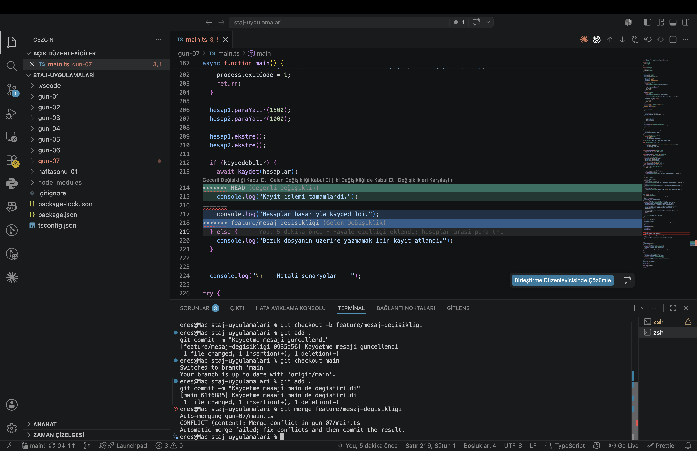

# Merge Conflict Cozumu

Bu dosyada, kasten olusturdugum bir merge conflict'i nasil cozdugumu adim adim anlattim.

## 1. Conflict'i olusturma

Ayni satiri iki farkli branch'te farkli sekilde degistirdim.

Once yeni bir branch acip `gun-07/main.ts` icindeki kaydetme mesajini degistirdim:

```bash
git checkout -b feature/mesaj-degisikligi
```

```typescript
console.log("Hesaplar basariyla kaydedildi.");
```

Sonra main'e donup **ayni satiri** farkli bir sekilde degistirdim:

```bash
git checkout main
```

```typescript
console.log("Kayit islemi tamamlandi.");
```

Iki degisikligi de ayri ayri commit ettim.

## 2. Merge denemesi ve conflict

```bash
git merge feature/mesaj-degisikligi
```

Cikti:

```
Auto-merging gun-07/main.ts
CONFLICT (content): Merge conflict in gun-07/main.ts
Automatic merge failed; fix conflicts and then commit the result.
```

Git iki versiyonu birbirine karistiramadi, cunku ikisi de ayni satiri degistiriyordu. Hangisinin dogru oldugunu bilemedigi icin karari bana birakti.

## 3. Conflict isaretlerini gorme

Dosyayi actigimda Git'in koydugu isaretleri gordum:



```
<<<<<<< HEAD
  console.log("Kayit islemi tamamlandi.");
=======
  console.log("Hesaplar basariyla kaydedildi.");
>>>>>>> feature/mesaj-degisikligi
```

Bu isaretlerin anlami:

- `<<<<<<< HEAD` alti: su an bulundugum branch'in (main) hali
- `=======` : iki versiyonu ayiran cizgi
- `>>>>>>> feature/mesaj-degisikligi` ustu: birlestirmeye calistigim branch'in hali

VS Code bunlari renkli gosteriyor ve ustlerinde "Gecerli Degisikligi Kabul Et / Gelen Degisikligi Kabul Et / Iki Degisikligi de Kabul Et" secenekleri cikiyor.

## 4. Cozum

Feature branch'teki versiyonu ("Hesaplar basariyla kaydedildi.") tercih ettim, cunku daha aciklayiciydi. Uc isaret satirini (`<<<<<<<`, `=======`, `>>>>>>>`) sildim ve sadece istedigim satiri biraktim:

```typescript
console.log("Hesaplar basariyla kaydedildi.");
```

## 5. Merge'i tamamlama

Conflict'i cozdukten sonra dosyayi stage'e alip commit ettim:

```bash
git add gun-07/main.ts
git commit -m "Merge conflict cozuldu: kaydetme mesaji"
```

Cikti:

```
[main b878336] Merge conflict cozuldu: kaydetme mesaji
```

`git status` ile kontrol ettim, working tree temizdi. Merge basariyla tamamlandi.

## Ogrendiklerim

- Conflict, iki branch'te ayni satirin farkli degistirilmesinden cikiyor. Git hangisinin dogru oldugunu bilemedigi icin karari bana birakiyor
- Conflict isaretleri (`<<<<<<<`, `=======`, `>>>>>>>`) Git'in koydugu gecici isaretler, cozdukten sonra hepsini silmek gerekiyor
- Cozmek demek "dogru satiri secip isaretleri temizlemek" demek; illa bir tarafi secmek zorunda degilim, ikisini birlestirebilir veya yepyeni bir sey de yazabilirim
- Cozdukten sonra `git add` + `git commit` ile merge'i tamamlamak sart, yoksa merge yarim kaliyor
- VS Code conflict'leri renkli gosterip tek tiklik secim butonlari sunuyor, bu isi kolaylastiriyor

Merge ederken yaptığım PR linki : https://github.com/enesalbas/staj-uygulamalari/pulls?q=is%3Apr+is%3Aclosed