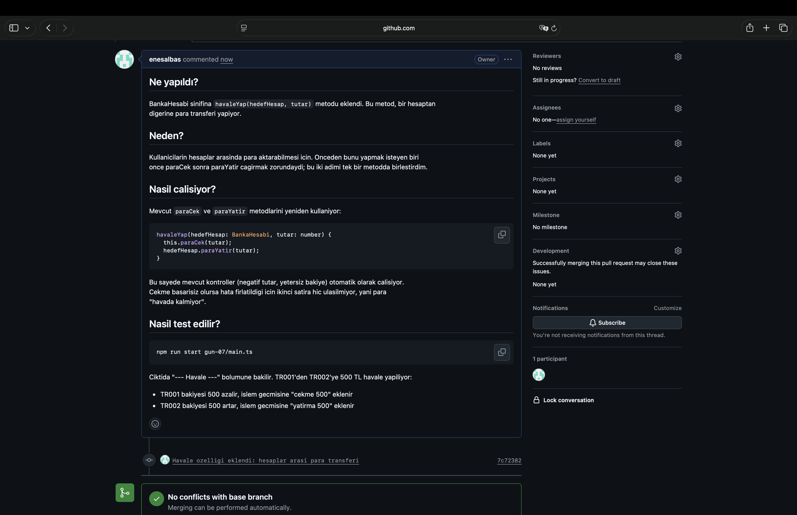

# Ekip Gibi Calis

Staj Gun 7 odevi. Branch, merge ve Pull Request akisini pratik ettim.

## Neler Yaptim

- `feature/banka-gelistirme` branch'i acip banka uygulamasina `havaleYap` metodu ekledim
  (hesaplar arasi para transferi)
- GitHub'da Pull Request actim, ne/neden/nasil test edilir formatinda acikladim ve merge ettim
- Kasten bir merge conflict olusturup cozdum, adimlarini `CONFLICT-COZUMU.md`'ye yazdim

## Havale Ozelligi

```typescript
havaleYap(hedefHesap: BankaHesabi, tutar: number) {
  this.paraCek(tutar);
  hedefHesap.paraYatir(tutar);
}
```

Mevcut `paraCek` ve `paraYatir` metodlarini yeniden kullaniyor, boylece kontroller
(negatif tutar, yetersiz bakiye) otomatik calisiyor. Cekme basarisiz olursa hata
firlatildigi icin ikinci satira hic ulasilmiyor, yani para "havada kalmiyor".

## Pull Request



PR linki: <https://github.com/enesalbas/staj-uygulamalari/pull/1>

## Conflict Cozumu

Detaylar icin: [CONFLICT-COZUMU.md](CONFLICT-COZUMU.md)

## Calistirma

```bash
npm run start gun-07/main.ts
```

## Ogrendiklerim

- **Branch**: ana kodu bozmadan paralel calisma alani
- **Pull Request**: birlestirmeden once gozden gecirme adimi; iyi bir PR aciklamasi
  ne/neden/nasil test edilir sorularini cevaplar
- **Merge conflict**: ayni satirin iki branch'te farkli degistirilmesinden cikiyor,
  Git karari gelistiriciye birakiyor