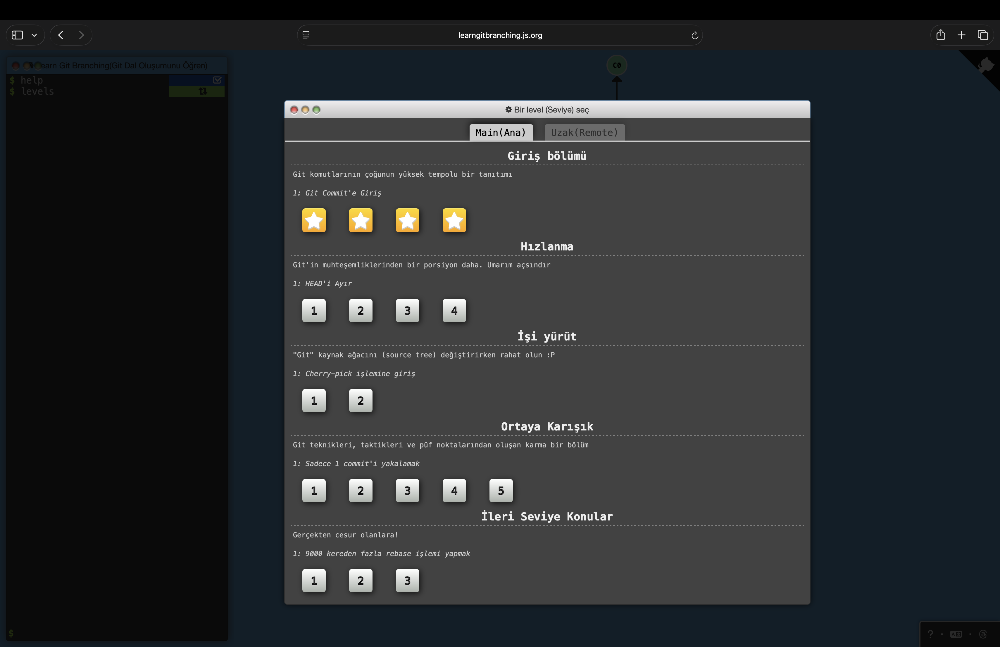

# Git Notlarim

Bu hafta sonu Git ogrenirken tuttugum notlar.

## Ogrendigim 10 Komut

1. **git init**
   Bir klasoru Git deposuna cevirir. Icinde gizli bir `.git` klasoru olusturur ve
   Git o klasordeki degisiklikleri takip etmeye baslar.

2. **git status**
   O an hangi dosyalarin degistigini, hangilerinin commit'e hazir oldugunu (staged),
   hangilerinin takip edilmedigini gosterir. En cok kullandigim komut.

3. **git add**
   Degisiklikleri staging area'ya ekler, yani "bu dosyayi bir sonraki commit'e dahil et"
   demis olurum. `git add .` ile tum degisiklikleri bir anda ekleyebilirim.

4. **git commit -m "mesaj"**
   Staging area'daki degisiklikleri kalici bir kayit (commit) olarak saklar. `-m` ile
   o kaydin ne oldugunu anlatan bir mesaj yazarim.

5. **git log --oneline**
   Gecmis commit'leri tek satir halinde listeler. Her commit'in kisa kodunu ve mesajini
   gosterir, gecmise hizli bakmak icin kullanislidir.

6. **git branch**
   Mevcut dallari (branch) listeler. Yeni bir dal olusturmak icin `git branch dal-adi`
   yazilir. Dallar, ana kodu bozmadan farkli seyler denemeyi saglar.

7. **git checkout / git switch**
   Dallar arasi gecis yapar. `git switch dal-adi` ile baska bir dala gecerim, calisma
   alanim o dalin durumuna gore degisir.

8. **git merge**
   Bir daldaki degisiklikleri baska bir dala birlestirir. Ornegin bir ozelligi ayri
   dalda gelistirip, bitince ana dala merge ederim.

9. **git remote add origin <url>**
   Yerel depoyu, GitHub'daki uzak depoya baglar. `origin`, uzak deponun kisa adidir.

10. **git push**
    Yerel commit'leri uzak depoya (GitHub'a) gonderir. `git pull` ise tam tersi, uzaktaki
    degisiklikleri yerele ceker.

# Staging Area 

Staging area, bir dosyayi degistirdikten sonra commit'lemeden once degisikligi tuttugum
ara bolge. Bir dosyayi degistirince direkt kaydedilmiyor, once `git add` ile staging'e
almam, sonra `git commit` ile kalici hale getirmem gerekiyor.

Faydasi su: ayni anda cok dosyada degisiklik yapsam bile, sadece istedigimi `git add` ile
secip commit'leyebiliyorum, gerisini sonraya birakabiliyorum. Boylece her commit'im duzenli
oluyor.

# Learn Git Branching — Giris Dizisi

[Learn Git Branching](https://learngitbranching.js.org/?locale=tr_TR) sitesindeki "Giris" dizisinin
4 seviyesini de tamamladim:

1. **Git Commit'e Giris** — commit'lerin bir zincir olusturdugunu, her commit'in bir oncekini isaret ettigini gordum
2. **Git'te Dallanma** — dalin aslinda bir commit'e isaret eden hafif bir etiket oldugunu ogrendim
3. **Git'te Birlestirme (merge)** — iki dali birlestiren ve iki ebeveyni olan yeni bir commit olusturuluyor
4. **Rebase'e Giris** — commit'leri baska bir dalin ucuna tasiyip duz bir gecmis elde ediliyor

Ekran goruntusunde "Giris bolumu" altindaki dort yildiz da dolu:

## merge ile rebase farki

Ikisi de degisiklikleri birlestiriyor ama gecmisi farkli birakiyorlar:

- **merge** gecmisi oldugu gibi birakir, birlesme yerinde iki ebeveynli bir commit olusur. Gecmis dallanmis
  gorunur ama gercekte ne olduysa o durur.
- **rebase** commit'leri hedef dalin ucuna yeniden yazar, gecmis duz bir cizgi olur. Okumasi daha kolay ama
  commit'ler yeniden yazildigi icin baskasiyla paylastigim dalda kullanmamam gerekiyormus.