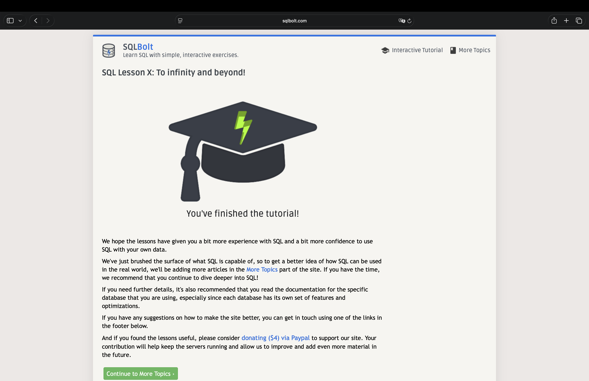

# SQL Notlarim

Hafta Sonu Odevi 2. SQLBolt ve Select Star SQL'i bitirdikten sonra tuttugum notlar.

## GROUP BY Ne Yapar?

GROUP BY, ayni degere sahip satirlari tek bir grupta topluyor. Boylece her grup icin ayri ayri hesap yapabiliyorum.

Ornegin developers tablosunda herkesin bir takimi var. `GROUP BY team` dedigimde, ayni takimdaki herkes tek bir gruba giriyor: butun Backend'ciler bir grup, butun Frontend'ciler baska grup. Sonra COUNT, SUM, AVG gibi fonksiyonlar bu gruplarin her biri icin ayri ayri calisiyor.

```sql
SELECT team, COUNT(*) AS kisi_sayisi
FROM developers
GROUP BY team;
```

Bu sorgu "her takimda kac kisi var" sorusunu cevapliyor. GROUP BY olmasaydi COUNT butun tabloyu tek seferde sayardi; GROUP BY ile her takim ayri sayiliyor.

Aslinda bu, TypeScript'te `reduce` ile yaptigim gruplama isinin ta kendisi:

```typescript
grup[kisi.team] = (grup[kisi.team] ?? 0) + 1;
```

Tek farki, SQL'de tek satirda oluyor ve isi veritabani yapiyor.

## INNER JOIN ile LEFT JOIN Farki

Iki tabloyu birlestirirken en onemli fark, **eslesmeyen satirlara ne oldugu**.

- **INNER JOIN**: sadece iki tabloda da eslesen satirlari getirir. Eslesmeyen tamamen duser.
- **LEFT JOIN**: sol tablonun butun satirlarini tutar. Sag tarafta eslesme yoksa o sutunlari NULL yapar.

Kendi ornegim: iki tablom var, `developers` (gelistiriciler) ve `commits` (commit'ler). Ada isminde bir gelistiricinin hic commit'i yok.

```
developers            commits
-----------           -------------------------
1  Zeynep             commit (developer_id = 1)
2  Ali                commit (developer_id = 2)
3  Ada                (yok)
```

### INNER JOIN sonucu

```sql
SELECT developers.name, commits.id
FROM developers
INNER JOIN commits ON developers.id = commits.developer_id;
```

```
name    commit_id
------  ---------
Zeynep  ...
Ali     ...
```

Ada listede YOK. Cunku commit'i olmadigi icin eslesme bulunamadi ve satiri dustu.

### LEFT JOIN sonucu

```sql
SELECT developers.name, commits.id
FROM developers
LEFT JOIN commits ON developers.id = commits.developer_id;
```

```
name    commit_id
------  ---------
Zeynep  ...
Ali     ...
Ada     NULL
```

Ada burada VAR, ama commit_id'si NULL. Cunku LEFT JOIN sol tablodaki (developers) herkesi koruyor, eslesme olmayinca sag tarafi bos birakiyor.

Iste bu yuzden "hic commit'i olmayanlari bul" sorusu sadece LEFT JOIN ile cozulur:

```sql
SELECT developers.name
FROM developers
LEFT JOIN commits ON developers.id = commits.developer_id
WHERE commits.id IS NULL;
```

INNER JOIN kullansaydim, aradigim kisi (Ada) zaten sonucta hic olmazdi. Yani INNER JOIN, tam da bulmak istedigim satiri en basta eliyor.

## WHERE ile HAVING Farki

Ikisi de filtreleme yapiyor ama **ne zaman** calistiklari farkli:

- **WHERE**: gruplama YAPILMADAN once, tek tek satirlari filtreler.
- **HAVING**: gruplama YAPILDIKTAN sonra, gruplari filtreler.

Basit kural: eger COUNT/SUM/AVG gibi bir grup sonucuna gore filtreliyorsam HAVING, tek tek satirlara gore filtreliyorsam WHERE.

Ornek soru: "3'ten fazla kisisi olan takimlari getir"

```sql
SELECT team, COUNT(*) AS kisi_sayisi
FROM developers
GROUP BY team
HAVING COUNT(*) > 3;
```

Burada `COUNT(*) > 3` bir grup sonucu, yani ancak gruplama bittikten sonra bilinebilir. O yuzden WHERE degil HAVING kullaniliyor.

Eger burada WHERE yazsaydim hata alirdim, cunku WHERE gruplama olmadan once calisir ve o an daha COUNT sonucu ortada yoktur.

Ikisini bir arada da kullanabilirim:

```sql
SELECT team, COUNT(*) AS kisi_sayisi
FROM developers
WHERE email IS NOT NULL       -- once: email'i olan satirlari al
GROUP BY team
HAVING COUNT(*) > 3;          -- sonra: 3'ten fazla kisisi olan gruplari al
```

Once WHERE tek tek satirlari suzuyor (email'i olmayanlar atiliyor), sonra kalanlar gruplaniyor, en son HAVING gruplari suzuyor. Calisma sirasi: WHERE -> GROUP BY -> HAVING.

## Ozet

- **GROUP BY**: ayni degerdeki satirlari grupla, her grup icin ayri hesap yap
- **INNER JOIN**: sadece eslesenler; **LEFT JOIN**: sol tablonun tamami, eslesmeyende NULL
- **WHERE**: gruplamadan once satirlari filtrele; **HAVING**: gruplamadan sonra gruplari filtrele

